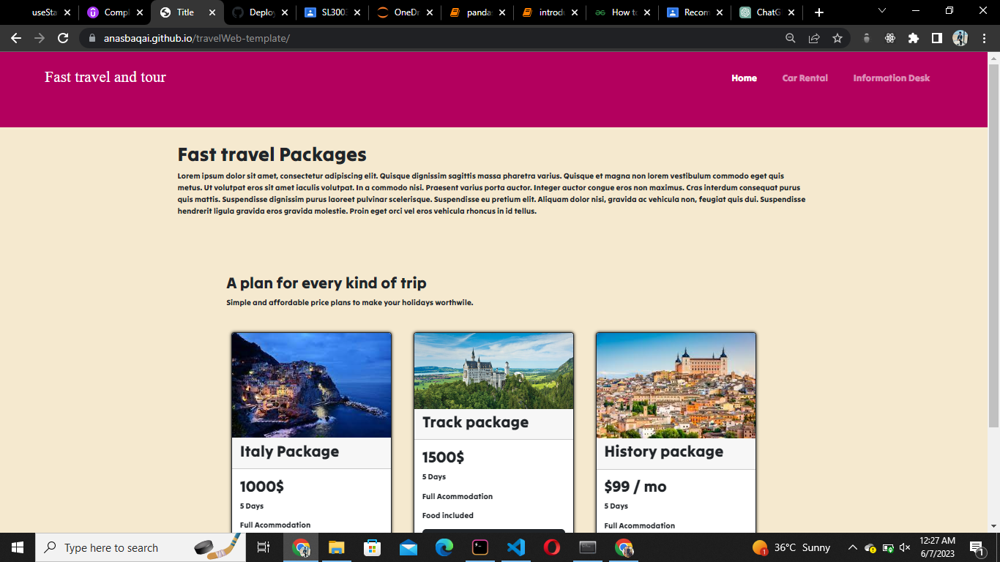

# TravelWeb Template



This repository contains a responsive web template for a travel-related website. It is built using HTML, CSS, and Bootstrap, providing a sleek and modern design that is suitable for showcasing travel destinations, packages, and related information.

## Demo

Check out the live demo of the TravelWeb Template [here](https://anasbaqai.github.io/travelWeb-template/).

## Features

- Responsive design: The template is optimized to work seamlessly across various devices and screen sizes.
- Attractive hero section: The hero section includes a visually appealing image and an eye-catching call-to-action button to capture users' attention.
- Destination showcase: Display travel destinations with high-quality images, short descriptions, and interactive hover effects.
- Services section: Highlight the services offered by your travel agency, such as hotel booking, transportation, and guided tours.
- Testimonials: Showcase customer reviews and testimonials to build trust and credibility.
- Contact form: Allow users to reach out to your travel agency through a contact form, enabling seamless communication.

## Getting Started

To get a local copy of this project up and running, follow these steps:

1. Clone the repository:

   ```shell
   git clone https://github.com/AnasBaqai/travelWeb-template.git
   
 2. Navigate to the project directory:
    cd travelWeb-template
 3. Open the index.html file in your preferred web browser.
## Customization
You can customize the template to fit your specific needs:

Replace the images in the img folder with your own destination photos.
Modify the text content in the HTML files to match your travel agency's information.
Customize the colors, fonts, and styles by modifying the CSS files in the css folder.
Update the contact form's action URL in the HTML to point to your preferred form submission endpoint.
## Contributing
Contributions are welcome! If you'd like to contribute to this project, please follow these steps:

Fork the repository.
Create a new branch for your feature/bug fix.
Make your changes and test thoroughly.
Submit a pull request, explaining the changes you've made.

## Please feel free to make any modifications or additions to the README file as needed
